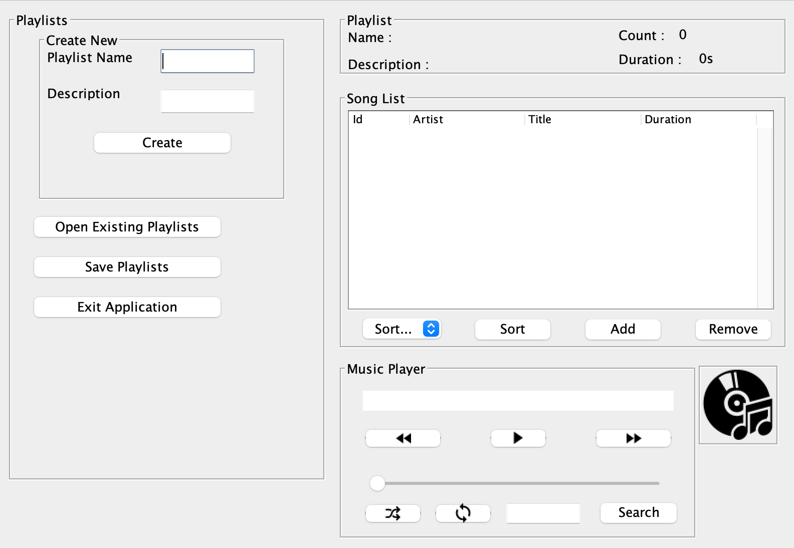

# Music Playlist Manager

A Java Swing desktop application for importing personal MP3 files, organizing playlists, reading track metadata, and controlling local audio playback.

The project began as a CMIS202 major project and has since been cleaned into a reproducible desktop-application showcase. Music files are selected from the user's computer and are never bundled with the repository.

---

## Features

- Import one or more MP3 files through a native file chooser
- Read track title, artist, album, duration, and embedded artwork
- Create, open, edit, and save Windows Media playlists (`.wpl`)
- Play, pause, skip, loop, and shuffle local tracks
- Search tracks by title
- Sort playlists by artist, title, or duration
- Display playlist count and total duration
- Preserve the last-used playlist directory locally
- Package the application as a runnable JAR

---

## Tech Stack

- Java 17
- Swing and AWT
- JLayer for MP3 playback
- mp3agic for ID3 metadata and album artwork
- XML playlist serialization
- Custom hash table, set, binary search tree, and quicksort implementations

---

## Application Preview



---

## Privacy and Media

This repository does **not** distribute songs or commercial album artwork. The portfolio screenshot intentionally shows the player without third-party media loaded. Use the file chooser to select MP3 files you own or are authorized to use.

Local media paths can be written into saved `.wpl` files, so playlists and application state are ignored by Git. See [`THIRD_PARTY.md`](THIRD_PARTY.md) for dependency attribution.

## Build and Run

### Prerequisite

Install Java 17 or newer:

```bash
java -version
```

### Run from source

```bash
./run.sh
```

The script builds `dist/music-playlist-manager.jar` automatically when needed.

### Build only

```bash
./build.sh
```

### Run the packaged application

```bash
java -jar dist/music-playlist-manager.jar
```

---

## Testing

Run the dependency-free data-structure smoke tests:

```bash
./test.sh
```

GitHub Actions also compiles, tests, packages, and uploads the runnable JAR as a workflow artifact.

---

## Project Structure

```text
mp3-player/
├── .github/workflows/
│   └── build.yml
├── docs/
│   └── MusicPlaylistManagerUMLDiagram.png
├── lib/
│   ├── jlayer-1.0.1.jar
│   └── mp3agic.jar
├── src/
│   ├── images/
│   ├── test/java/
│   └── *.java
├── build.sh
├── run.sh
├── test.sh
├── THIRD_PARTY.md
└── README.md
```

---

## Academic Context

The original application was created for the CMIS202 major-project requirements. The repository demonstrates Java desktop UI development, event-driven programming, media handling, persistence, and implementation of core data structures.

Original presentation: <https://youtu.be/_jN56H13nDE>

---

## Future Improvements

- Replace absolute-position Swing layouts with responsive layout managers
- Improve playback-thread lifecycle and error messages
- Add automated tests for playlist serialization and MP3 metadata parsing
- Add drag-and-drop media importing
- Add a dark theme and keyboard shortcuts
- Publish a signed v1.0 release after third-party license verification
